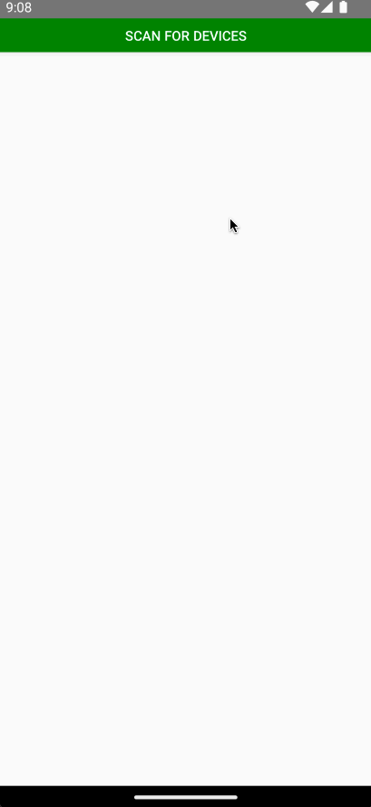
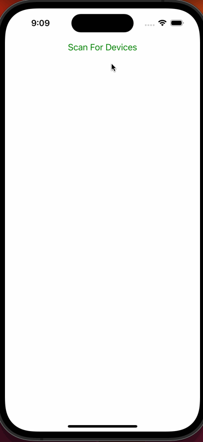

# react-native-flir

Flir SDK module for React Native

## Installation

### Install the NPM package

#### Using Yarn

```sh
yarn add react-native-flir
```

#### Using NPM

```sh
npm install react-native-flir
```

### Link the native module

```sh
npx pod-install
```

## Native Setup

### Android Configuration

1. Update `minSdkVersion` to `28` inside `android/build.gradle` file.

```gradle
buildscript {
    ext {
        minSdkVersion = 28
    }
}
```

2. Update `packagingOptions` inside `android/app/build.gradle` file.

```gradle
android {
    packagingOptions {
        pickFirst 'lib/**/*.so'
    }
}
```

### iOS Configuration

1. Update the `ios/{FlirPoject}/Info.plist` file.

```xml
<dict>
    ...
	<key>UISupportedExternalAccessoryProtocols</key>
	<array>
		<string>com.flir.rosebud.fileio</string>
		<string>com.flir.rosebud.config</string>
		<string>com.flir.rosebud.frame</string>
	</array>
</dict>
```

## Usage

```tsx
import React, { useState } from 'react';
import { Dimensions, View, Button, SafeAreaView } from 'react-native';
import { useFlir, FlirCameraView } from 'react-native-flir';

const useStream = () => {
  const [streaming, setStreaming] = useState(false);

  return {
    active: streaming,
    start: () => setStreaming(true),
    stop: () => setStreaming(false),
  };
};

const useThermal = () => {
  const [thermal, setThermal] = useState(false);

  return {
    active: thermal,
    enable: () => setThermal(true),
    disable: () => setThermal(false),
  };
};

const { width, height } = Dimensions.get('window');

const App = () => {
  const {
    scanning,
    connected,
    streaming,
    device,
    start,
    stop,
    connect,
    disconnect,
  } = useFlir();
  const stream = useStream();
  const thermal = useThermal();

  return (
    <SafeAreaView style={{ flex: 1 }}>
      {!streaming && !connected && !scanning && (
        <Button title="Scan For Devices" onPress={start} color={'green'} />
      )}
      {!streaming && !connected && scanning && (
        <Button
          title="Stop Scanning For Devices"
          onPress={stop}
          color={'red'}
        />
      )}
      {!streaming && !connected && scanning && device && (
        <Button title={`Connect ${device}`} onPress={connect} color={'green'} />
      )}
      {!streaming && connected && (
        <Button
          title={`Disconnect ${device}`}
          onPress={disconnect}
          color={'red'}
        />
      )}
      {!streaming && connected && (
        <Button
          title="Start Streaming"
          onPress={stream.start}
          color={'green'}
        />
      )}
      {streaming && connected && (
        <Button title="Stop Streaming" onPress={stream.stop} color={'red'} />
      )}
      {streaming && connected && (
        <Button
          title={thermal.active ? 'Disable Thermal' : 'Enable Thermal'}
          onPress={thermal.active ? thermal.disable : thermal.enable}
          color={thermal.active ? 'red' : 'green'}
        />
      )}
      <View style={{ opacity: streaming ? 1 : 0 }}>
        <FlirCameraView
          stream={stream.active}
          thermal={thermal.active}
          width={width}
          height={height / 1.5}
        />
      </View>
    </SafeAreaView>
  );
};
```

| Example Android Flir Demo                       | Example IOS Flir Demo                   |
| ----------------------------------------------- | --------------------------------------- |
|  |  |

## API

### `FlirCameraView`

```tsx
interface FlirCameraViewProps {
  //
  // Indicates if the camera view should stream data from the device.
  stream: boolean;
  //
  // Indicates if the camera view should display thermal data.
  thermal: boolean;
  //
  // The width of the camera view.
  width: number;
  //
  // The height of the camera view.
  height: number;
}
```

### `getFlir`

```ts
interface Flir {
  //
  // Indicates if the module is currently scanning for devices.
  scanning: boolean;
  //
  // Indicates if the module is currently connected to a device.
  connected: boolean;
  //
  // Indicates if the module is currently streaming data from a device.
  streaming: boolean;
  //
  // Returns the frame rate of the active stream.
  fps: number;
  //
  // Connects the module to the detected device from the scan.
  connect: () => void;
  //
  // Disconnects the module from the connected device.
  disconnect: () => void;
  //
  // Starts scanning for devices.
  start: () => void;
  //
  // Stops scanning for devices.
  stop: () => void;
  //
  // Invokes callback with the device identifier when a device is found.
  onDeviceFound: (callback: (device: string) => void) => EmitterSubscription;
  //
  // Invokes callback with the device identifier when a device is lost.
  onDeviceLost: (callback: (device: string) => void) => EmitterSubscription;
  //
  // Invokes callback with the error message when a device scan error occurs.
  onDeviceScanError: (callback: (error: string) => void) => EmitterSubscription;
  //
  // Invokes callback with the device identifier when a device is connected.
  onDeviceConnected: (callback: (device: string) => void) => EmitterSubscription;
  //
  // Invokes callback with the device identifier when a device is disconnected.
  onDeviceDisconnected: (callback: (device: string) => void) => EmitterSubscription;
```

### `useFlir`

```ts
interface UseFlir extends Flir {
  // Returns the device identifier of the connected device.
  device: string;
}
```

## Contributing

### Running the Example App

1. Install the dependencies: `yarn`
2. Start the packager: `yarn example start`
3. Build the native application: `yarn example android` or `yarn example ios`

See the [contributing guide](CONTRIBUTING.md) to learn how to contribute to the repository and the development workflow.

## License

MIT

---

Made with [create-react-native-library](https://github.com/callstack/react-native-builder-bob)
